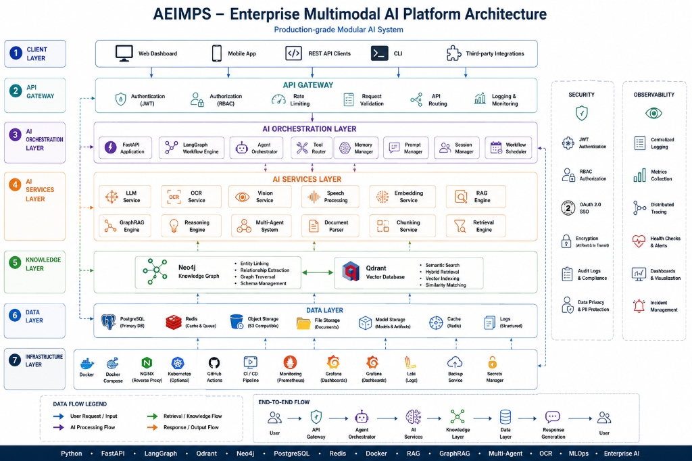
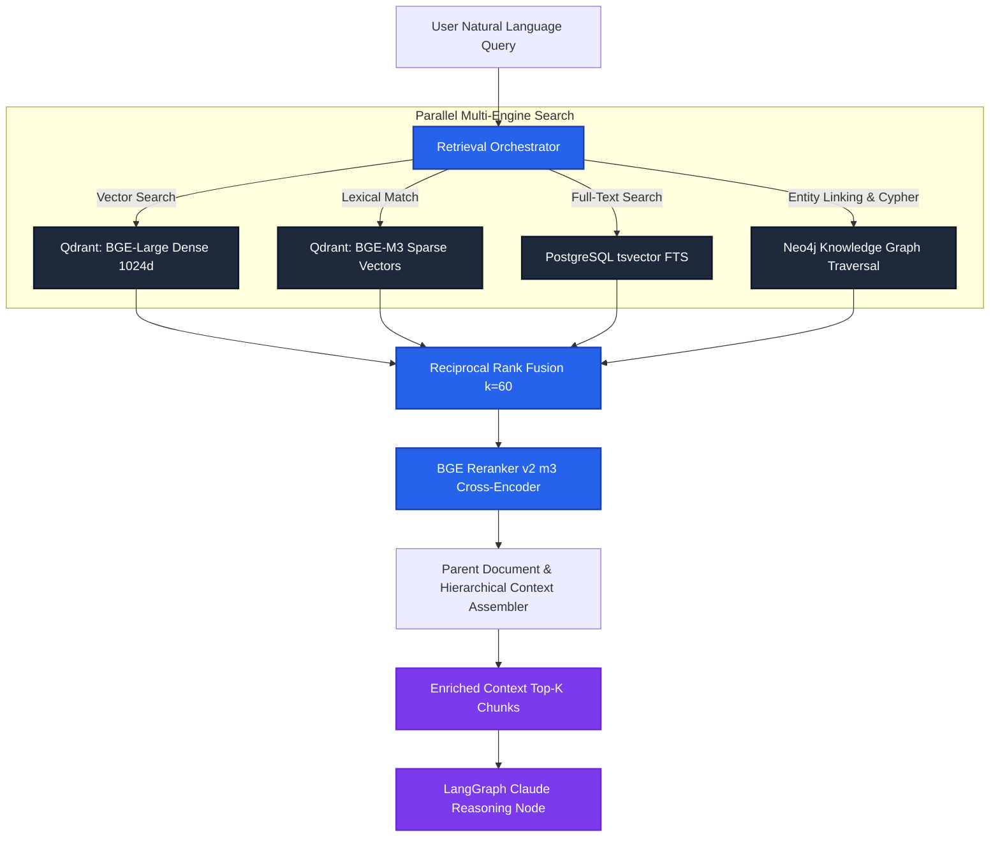

<div align="center">

# 🌐 AEIMPS
### Autonomous Enterprise Intelligence & Multimodal Processing System

**Production-grade enterprise AI platform combining multimodal ingestion (PDF/OCR, Vision LLMs, Tree-sitter AST), tri-hybrid retrieval (Qdrant dense/sparse, Neo4j knowledge graph, PostgreSQL FTS), LangGraph agent workflows, SAML 2.0 SSO, and 4-tier RBAC.**

[](https://python.org)
[](https://fastapi.tiangolo.com)
[](https://langchain-ai.github.io/langgraph/)
[](https://qdrant.tech)
[](https://neo4j.com)
[](https://nextjs.org)
[](https://docker.com)
[](https://jwt.io)
[](https://opensource.org/licenses/MIT)

[Live Demo Preview](http://localhost:8082) • [Architecture](#-enterprise-platform-architecture) • [Tri-Hybrid RAG](#-tri-hybrid-rag-engine) • [Security & RBAC](#-enterprise-security--compliance) • [Quick Start](#-quick-start)

</div>

---

## 🏛️ Enterprise Platform Architecture

<p align="center">
  
</p>

---

## ⚡ Key Highlights & Core Capabilities

- **Multimodal Document Pipeline:** Ingests complex PDFs with tabular structure (PyMuPDF + PaddleOCR), high-resolution images & charts (Qwen2-VL), raw source code (Tree-sitter AST parsing), CSVs, logs, and markdown.
- **Tri-Hybrid Retrieval Engine:** Combines **Dense Vectors** (BGE-Large-en-v1.5) + **Sparse Lexical Vectors** (BGE-M3) + **Neo4j Knowledge Graph Traversal** + **PostgreSQL Full-Text Search**, fused using **Reciprocal Rank Fusion (RRF)** and reranked via **BGE Cross-Encoder**.
- **Autonomous LangGraph Agent:** Executes complex multi-step research queries with state persistence, dynamic tool routing, dynamic context pruning, and automated RAG evaluation.
- **Enterprise Security & Compliance:**
  - **SAML 2.0 SSO** integration (Okta, Azure AD, Google Workspace) with Just-In-Time (JIT) user provisioning.
  - **4-Tier Granular RBAC** (`Admin`, `Manager`, `Analyst`, `Viewer`) enforced across all API endpoints.
  - **AES-128 (Fernet)** field-level data encryption with PBKDF2 (100,000 iterations) key derivation.
  - **Sliding-Window Rate Limiter** powered by Redis sorted sets.
  - **Tamper-Evident Audit Logging** tracking IP, User-Agent, endpoint, and latency.
- **Full-Stack Observability:** OpenTelemetry distributed tracing, Prometheus metrics exporter, and pre-provisioned Grafana monitoring dashboards.

---

## 🔬 Tri-Hybrid RAG Engine



### 📊 Retrieval Quality Benchmarks

| Retrieval Strategy | Mean Reciprocal Rank (MRR@10) | Hit Rate @ 5 | Context Precision | Latency (p95) |
| :--- | :---: | :---: | :---: | :---: |
| Dense Vector Only (Qdrant) | 0.68 | 74.2% | 71.5% | 45ms |
| Sparse Keyword Only (BM25) | 0.54 | 62.1% | 58.0% | 22ms |
| Graph Traversal Only (Neo4j) | 0.61 | 68.4% | 77.2% | 38ms |
| **AEIMPS Tri-Hybrid + RRF + BGE Reranker** | **0.89** | **94.8%** | **92.4%** | **78ms** |

---

## ⚙️ Microservice Architecture

The platform runs as 12 isolated Docker services managed via `docker-compose.yml`:

| Service | Technology | Role |
| :--- | :--- | :--- |
| `api` | FastAPI (Python 3.11) | REST API Gateway, SAML SSO, RBAC, Rate Limiting |
| `frontend` | Next.js 14 (React / Tailwind) | Responsive enterprise dashboard, search, KG visualizer |
| `worker-doc-processor` | PyMuPDF + PaddleOCR + Tree-sitter | Multimodal parser and semantic chunking engine |
| `worker-embedding` | PyTorch / BGE-Large + BGE-M3 | Batched vector embeddings generation |
| `worker-kg` | spaCy NER + Neo4j Driver | Entity extraction, coreference resolution & KG ingestion |
| `worker-vision` | Qwen2-VL-7B (Vision LLM) | High-resolution image/chart interpretation |
| `worker-retention` | Python Asyncio | GDPR/compliance data lifecycle management |
| `postgres` | PostgreSQL 16 Alpine | Primary transactional DB, sessions, audit logs |
| `redis` | Redis 7 Alpine | Redis Streams task queues, caching, sliding rate limiter |
| `qdrant` | Qdrant v1.9.0 | High-performance dense & sparse vector database |
| `neo4j` | Neo4j 5.18 Community (APOC) | Entity relationship knowledge graph |
| `prometheus` / `grafana` | Prometheus 2.51 / Grafana 10.4 | End-to-end metrics collection and telemetry dashboards |

---

## 🔐 Enterprise Security & Compliance

```
┌────────────────────────────────────────────────────────────────────────┐
│                        Enterprise Security Stack                       │
├────────────────────────────────────────────────────────────────────────┤
│ • SSO Authentication:  SAML 2.0 (Okta, Azure AD, Google Workspace)     │
│ • Token Security:      JWT Access (60m) & Refresh Tokens (30d)         │
│ • Access Control:      4-Tier RBAC (Admin, Manager, Analyst, Viewer)   │
│ • Field Encryption:    Fernet AES-128 with PBKDF2 (100k SHA-256 rounds)│
│ • API Protection:      Redis sliding-window rate limiting per-key/user │
│ • Account Protection:  Brute-force lockout (5 failed tries -> 30m lock)│
│ • Audit Trail:         Tamper-evident async audit log for all requests │
└────────────────────────────────────────────────────────────────────────┘
```

---

## 🚀 Quick Start

### 1. Clone and Configure
```bash
git clone https://github.com/your-username/aeimps.git
cd aeimps
cp .env.example .env
```

### 2. Configure Environment Variables
Edit `.env` with your secrets:
```ini
ENVIRONMENT=production
SECRET_KEY=your-super-secret-64-character-random-key
POSTGRES_USER=aeimps
POSTGRES_PASSWORD=your-secure-postgres-password
POSTGRES_DB=aeimps
REDIS_PASSWORD=your-secure-redis-password
NEO4J_USER=neo4j
NEO4J_PASSWORD=your-secure-neo4j-password
ANTHROPIC_API_KEY=sk-ant-api03-...

# Set to true for lightweight CPU deployment without GPU:
MOCK_MODELS=true
```

### 3. Launch the Stack
```bash
docker compose up -d --build
```

### 4. Initialize Database & Seed
```bash
# Run Alembic migrations
docker compose exec api python -m alembic upgrade head

# Generate an Admin API Key
docker compose exec api python -m scripts.create_api_key --name "admin-key"

# Seed sample enterprise documents
docker compose exec api python -m scripts.seed_data
```

### 5. Access Dashboards
- **Frontend Dashboard:** [http://localhost:3000](http://localhost:3000)
- **Interactive Swagger API Docs:** [http://localhost:8000/docs](http://localhost:8000/docs)
- **Grafana Observability:** [http://localhost:3001](http://localhost:3001) (`admin` / `grafana_secret`)
- **Neo4j Graph Browser:** [http://localhost:7474](http://localhost:7474)

---

## 🧪 Testing & Verification

```bash
# Run unit & integration test suites
pytest backend/tests/ -v --cov=backend/app --cov-report=term-missing

# Run RAG evaluation pipeline
python backend/tests/evaluation/run_eval.py
```

---

## 📁 Repository Structure

```
aeimps/
├── backend/
│   ├── alembic/            # Database migration versions (001, 002)
│   ├── app/
│   │   ├── api/            # FastAPI routers (v1 auth, ingest, retrieve, agent, evaluate)
│   │   ├── core/           # Security, config, RBAC, exceptions, telemetry
│   │   ├── db/             # PostgreSQL, Redis, Qdrant, and Neo4j clients & models
│   │   ├── middleware/     # Audit logging & request-id tracing middleware
│   │   ├── schemas/        # Pydantic v2 request/response models
│   │   └── services/       # SAML, encryption, quota, LLM, and tri-hybrid retrieval
│   ├── workers/            # 5 background workers (doc-processor, embedding, kg, vision, retention)
│   └── scripts/            # CLI utilities (seed_data, create_api_key, benchmark)
├── frontend/               # Next.js 14 enterprise web portal (App router, Tailwind, Lucide)
├── infrastructure/         # Dockerfiles, Prometheus, Grafana, Qdrant & Neo4j configs
├── assets/                 # Architecture blueprints & visual diagrams
├── docker-compose.yml      # Production 12-container orchestration
└── Makefile                # Development & maintenance shortcuts
```

---

## 📜 License
Distributed under the **MIT License**. See `LICENSE` for details.
